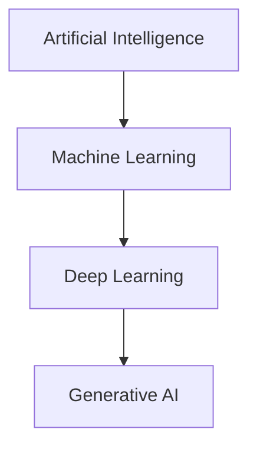

# 01 - Introduction to AI

> **Volume 01 – Java AI Foundations**

## Learning Objectives

After this chapter you will understand:

- What Artificial Intelligence (AI) is
- AI vs Machine Learning vs Deep Learning vs Generative AI
- Why Java developers should learn AI
- Where Spring AI fits
- Common AI applications
- Basic AI ecosystem

---

# What is Artificial Intelligence?

Artificial Intelligence (AI) is the field of computer science focused on building systems that can perform tasks that normally require human intelligence.

Examples:

- Answering questions
- Understanding language
- Recognizing images
- Writing code
- Translating languages

AI **does not think like a human**. It predicts the most likely output from patterns learned from data.

---

# Why was AI created?

Traditional software only follows predefined rules.

```text
if age >= 18
   allowVote()
else
   reject()
```

But many problems cannot be solved using fixed rules:

- Face recognition
- Speech recognition
- Chatbots
- Medical diagnosis

AI learns patterns instead of relying only on hard-coded logic.

---

# AI vs Machine Learning vs Deep Learning vs Generative AI

| Technology | Purpose | Example |
|------------|---------|---------|
| AI | Make machines perform intelligent tasks | Chatbot |
| Machine Learning | Learn patterns from data | Spam detection |
| Deep Learning | Neural networks for complex tasks | Image recognition |
| Generative AI | Generate new content | ChatGPT |



---

# Where Java Fits

Java is widely used for enterprise systems.

Typical architecture:


Java handles:

- Authentication
- Business logic
- Databases
- APIs

Spring AI connects your Java application to AI models.

---

# Real World Examples

| Product | AI Feature |
|---------|------------|
| Gmail | Smart Reply |
| Netflix | Recommendations |
| GitHub Copilot | Code completion |
| ChatGPT | Conversational AI |

---

# Why Java Developers Should Learn AI

- Existing enterprise projects are written in Java.
- Companies are adding AI features instead of rewriting systems.
- Spring AI makes AI integration straightforward.

Examples:

- AI customer support
- Resume analyzer
- PDF chatbot
- SQL assistant
- Internal knowledge bot

---

# AI Ecosystem

```text
User
 ↓
Spring Boot
 ↓
Spring AI
 ↓
LLM
 ↓
Response
```

Future additions:

- Embeddings
- Vector Database
- RAG
- AI Agents
- MCP

---

# Common Myths

❌ AI will replace every developer.

✅ AI increases developer productivity.

❌ Java cannot be used for AI.

✅ Java is excellent for building AI-powered enterprise applications.

---

# Mini Project

Build a Spring Boot REST API that sends a prompt to Ollama using Spring AI and returns the response.

You will build this in Volume 02.

---

# Interview Questions

1. What is AI?
2. Difference between AI and ML?
3. What is Generative AI?
4. Why is Spring AI useful?
5. Where does Java fit into AI applications?

---

# Exercises

- List five AI products you use every week.
- Identify one feature in your current project that could be AI-powered.
- Draw the architecture of a Spring Boot + Spring AI application.

---

# Summary

You learned:

- AI basics
- AI hierarchy
- AI ecosystem
- Java's role
- Spring AI overview

Next chapter: **02-Generative-AI.md**
