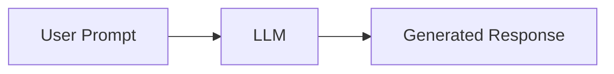

# 02 - Generative AI

> **Volume 01 – Java AI Foundations**

## Learning Objectives

By the end of this chapter you will understand:

- What Generative AI is
- How it differs from Traditional AI
- Common Generative AI models
- Enterprise use cases
- How Java developers use Generative AI with Spring AI

---

# What is Generative AI?

Generative AI is a branch of Artificial Intelligence that creates **new content** instead of only analyzing existing data.

It can generate:

- Text
- Images
- Code
- Audio
- Video

Examples:

- ChatGPT
- GitHub Copilot
- Gemini
- Claude

---

# Traditional AI vs Generative AI

| Traditional AI | Generative AI |
|---------------|---------------|
| Classifies data | Creates new content |
| Predicts labels | Generates text, images, code |
| Spam Detection | Email Writing |
| Fraud Detection | Code Assistant |

---

# Why is Generative AI Important?

Businesses want software that can:

- Answer customer questions
- Generate reports
- Write SQL
- Summarize documents
- Analyze resumes
- Search company knowledge

Instead of building separate models, developers now integrate an LLM.

---

# How Generative AI Works



The model predicts the next most probable token repeatedly until the answer is complete.

---

# Popular Models

| Model | Company | Best For |
|-------|---------|----------|
| GPT | OpenAI | General purpose |
| Gemini | Google | Productivity |
| Claude | Anthropic | Long documents |
| Llama | Meta | Open-source & local |
| Mistral | Mistral AI | Fast inference |

---

# Enterprise Use Cases

## Customer Support

User asks a question.

↓

LLM generates an answer.

---

## Resume Analyzer

Upload Resume

↓

LLM extracts skills

↓

Java application stores results.

---

## PDF Chatbot

PDF

↓

Embeddings

↓

Vector Database

↓

LLM

↓

Answer

---

## SQL Generator

Natural Language

↓

LLM

↓

SQL Query

↓

Database

---

# Java + Spring AI Perspective

Without Spring AI:

- Build HTTP requests
- Parse JSON
- Handle errors manually

With Spring AI:

```text
Spring Boot
    ↓
Spring AI
    ↓
OpenAI / Ollama / Gemini
```

You focus on business logic while Spring AI handles model integration.

---

# Where You'll Use It

- AI Chatbots
- Email Generator
- Documentation Assistant
- Meeting Notes Summarizer
- Coding Assistant
- Customer Support
- Knowledge Base Search

---

# Best Practices

- Give clear prompts.
- Validate user input.
- Never expose API keys.
- Log prompts carefully (avoid sensitive data).
- Add human review for critical workflows.

---

# Common Mistakes

- Expecting AI to always be correct.
- Blindly trusting generated code.
- Ignoring token costs.
- Sending huge prompts without optimization.

---

# Mini Project

Build an AI Email Generator.

Input:

- Recipient
- Purpose
- Tone

Output:

Professional email generated by an LLM.

---

# Interview Questions

1. What is Generative AI?
2. How is it different from Traditional AI?
3. Name five popular LLMs.
4. Why is Generative AI useful in enterprise software?
5. Why should Java developers learn Spring AI?

---

# Exercises

1. List three business problems that Generative AI can solve.
2. Compare ChatGPT and Llama.
3. Design a Spring Boot application that uses an LLM.

---

# Summary

In this chapter you learned:

- Definition of Generative AI
- Traditional AI vs Generative AI
- Popular LLMs
- Enterprise applications
- Java + Spring AI perspective

## Next Chapter

**03-Large-Language-Models.md**
