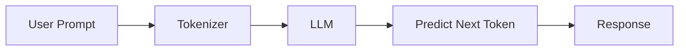
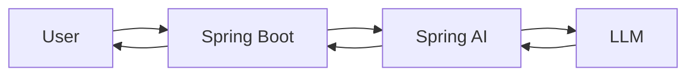

# 03 - Large Language Models (LLMs)

> **Volume 01 – Java AI Foundations**

## Learning Objectives

After this chapter you will understand:

- What an LLM is
- How an LLM works
- Training vs Inference
- Parameters
- Popular LLMs
- How Java applications communicate with LLMs using Spring AI

---

# What is a Large Language Model?

A Large Language Model (LLM) is an AI model trained on massive amounts of text to understand and generate human language.

LLMs can:

- Answer questions
- Write code
- Summarize documents
- Translate languages
- Generate emails
- Explain concepts

Examples:

- GPT
- Gemini
- Claude
- Llama
- Mistral
- Qwen

---

# Why are they called "Large"?

Because they are trained using:

- Billions of words (tokens)
- Huge datasets
- Billions of parameters
- Powerful GPUs

---

# How an LLM Works



The model predicts one token at a time until the response is complete.

---

# Training vs Inference

## Training

During training the model learns patterns from massive datasets.

Characteristics:

- Expensive
- Takes weeks or months
- Requires GPU clusters

Companies that train models:

- OpenAI
- Meta
- Google
- Anthropic
- Mistral AI

---

## Inference

Inference means using an already trained model.

Example:

```text
User
↓

"Explain Spring Boot"

↓

LLM

↓

Generated Answer
```

As Java developers, we mostly work with **inference**, not training.

---

# Parameters

Parameters represent what the model has learned.

Examples:

| Model | Parameters |
|--------|-----------:|
| Llama 3 8B | 8 Billion |
| Llama 3 70B | 70 Billion |

General idea:

- More parameters → better reasoning (often)
- More parameters → more RAM/GPU required

---

# Popular LLMs

| Model | Company | Open Source |
|-------|---------|-------------|
| GPT | OpenAI | No |
| Gemini | Google | No |
| Claude | Anthropic | No |
| Llama | Meta | Yes |
| Mistral | Mistral AI | Yes |
| Qwen | Alibaba | Yes |

---

# Open vs Closed Models

## Open Models

- Llama
- Mistral
- Qwen

Benefits:

- Run locally
- More control
- Lower long-term cost

## Closed Models

- GPT
- Gemini
- Claude

Benefits:

- High quality
- Managed by provider
- Easy API access

---

# LLM in a Java Application



Spring AI simplifies communication with different LLM providers.

---

# Real-world Applications

- AI Chatbot
- Coding Assistant
- Customer Support
- Document Summarizer
- Email Generator
- Resume Analyzer
- SQL Generator

---

# Best Practices

- Choose the right model for the task.
- Use local models for sensitive data.
- Keep prompts clear.
- Monitor token usage.
- Validate AI output before executing business actions.

---

# Common Mistakes

- Assuming the model always knows the latest information.
- Sending unnecessary long prompts.
- Ignoring hallucinations.
- Using very large models when a smaller one is enough.

---

# Mini Project

Create a Spring Boot endpoint that sends a prompt to an LLM and returns the generated response.

---

# Interview Questions

1. What is an LLM?
2. What is the difference between training and inference?
3. What are parameters?
4. Name three open-source LLMs.
5. Why is Spring AI useful?

---

# Exercises

1. Compare GPT and Llama.
2. List five tasks an LLM can perform.
3. Draw the flow of a Spring Boot application communicating with an LLM.

---

# Summary

You learned:

- What an LLM is
- How it works
- Training vs Inference
- Parameters
- Popular models
- Java + Spring AI integration

## Next Chapter

**04-Tokens.md**
