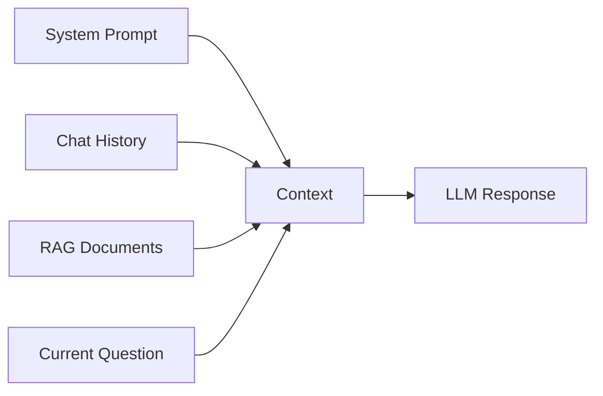

# 05 - Context Window

> **Volume 01 – Java AI Foundations**

## Learning Objectives

After this chapter you will understand:

- What a context window is
- Why it matters
- Context Window vs Memory
- How it affects responses
- Best practices for Java + Spring AI applications

---

# What is a Context Window?

A context window is the maximum amount of information an LLM can consider while generating a response.

It includes:

- System Prompt
- User Prompt
- Conversation History
- Retrieved Documents (RAG)
- Current Question

---

# Simple Example

```
System Prompt

+

Previous Messages

+

Current Question

=

Context Window
```

If the total exceeds the model's limit, older information may be dropped or the request may fail.

---

# Why is it Important?

The context window determines:

- How much the AI can "remember" during one request
- How large a document it can analyze
- How long a conversation can stay coherent

---

# Context Window vs Memory

| Context Window | Memory |
|---------------|--------|
| Temporary | Can be persistent |
| Exists during a request | Can survive multiple sessions |
| Limited by model | Usually stored externally |

Memory is often implemented using databases or vector stores, not just the model itself.

---

# Context Flow



---

# Real-world Example

Customer asks:

1. "My name is Sachin."
2. "I am learning Spring AI."
3. "What am I learning?"

If all three messages fit inside the context window, the model can answer correctly.

---

# Context Window in Spring AI

Typical flow:

```
User

↓

Spring Boot

↓

Spring AI

↓

LLM

↓

Response
```

Spring AI sends the conversation and prompts to the model. If you use RAG, retrieved document chunks also become part of the context.

---

# Common Mistakes

- Sending an entire PDF to the model
- Keeping unnecessary chat history
- Ignoring model limits
- Repeating the same instructions

---

# Best Practices

- Keep prompts concise.
- Summarize long conversations.
- Use RAG instead of huge prompts.
- Store long-term memory outside the LLM.
- Select a model with an appropriate context size.

---

# Mini Project

Create a chatbot that remembers the previous 5 messages and answers follow-up questions correctly.

---

# Interview Questions

1. What is a context window?
2. How is it different from memory?
3. Why is it important for chatbots?
4. How does RAG affect the context window?
5. How can developers optimize context usage?

---

# Exercises

1. Draw the context flow of a chatbot.
2. Explain why large PDFs should not be sent directly.
3. Compare context window and persistent memory.

---

# Summary

You learned:

- Context Window basics
- Context vs Memory
- Why context affects AI quality
- Spring AI perspective
- Optimization techniques

## Next Chapter

**06-Temperature.md**
