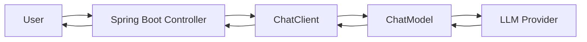
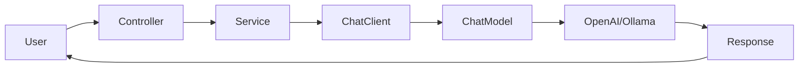

# 01 - Introduction to Spring AI

> **Volume 02 – Spring AI**

---

# Learning Objectives

After completing this chapter, you will understand:

- What is Spring AI?
- Why Spring AI was created
- Problems it solves
- Spring AI Architecture
- Supported AI Providers
- How Spring AI fits into Spring Boot
- Why Java developers should learn Spring AI

---

# Prerequisites

Before learning Spring AI, you should know:

- Java
- Spring Boot
- REST APIs
- Maven
- Dependency Injection
- Basic AI Concepts (Volume 01)

---

# What is Spring AI?

Spring AI is an official Spring ecosystem project that makes it easy to integrate **Large Language Models (LLMs)** into Java applications.

Instead of manually calling AI APIs using `RestTemplate` or `WebClient`, Spring AI provides a clean abstraction similar to Spring Data and Spring Security.

Think of it as:

```
Spring Data → Database

Spring Security → Authentication

Spring AI → Artificial Intelligence
```

---

# Why Was Spring AI Created?

Before Spring AI, developers had to:

- Build HTTP requests manually
- Manage authentication headers
- Parse JSON responses
- Handle provider-specific APIs
- Maintain separate integrations for OpenAI, Ollama, Gemini, etc.

Example without Spring AI:

```
Java

↓

RestTemplate

↓

HTTP Request

↓

JSON Parsing

↓

LLM

↓

JSON Response

↓

Manual Object Mapping
```

This approach becomes difficult to maintain as your application grows.

Spring AI removes this complexity.

---

# How Spring AI Solves the Problem

With Spring AI:

```
Java

↓

Spring AI

↓

OpenAI / Ollama / Gemini

↓

AI Response
```

You focus on business logic while Spring AI handles communication with AI providers.

---

# Spring AI Architecture



---

# Core Components

## ChatClient

High-level API used to communicate with an LLM.

Example:

```java
chatClient.prompt()
```

---

## ChatModel

Represents the AI model.

Examples:

- OpenAI
- Ollama
- Gemini
- Anthropic

---

## Prompt

The instruction sent to the model.

Example:

```
Explain Spring Boot.
```

---

## PromptTemplate

Reusable prompt with variables.

Example:

```
Hello {name}
```

---

## Chat Memory

Stores previous conversations.

Useful for:

- AI Chatbots
- Customer Support
- Personal Assistants

---

## Advisors

Interceptors that execute before or after an AI request.

Used for:

- Logging
- Security
- Memory
- Monitoring

---

## Structured Output

Convert AI responses directly into Java objects.

Instead of

```
String
```

You can receive

```java
Resume
Employee
Book
Product
```

---

## Tool Calling

Allows AI to call Java methods.

Example

```
AI

↓

WeatherService

↓

Weather API

↓

Response
```

---

# Supported AI Providers

Spring AI supports many providers.

Examples:

| Provider | Local/Cloud |
|------------|------------|
| OpenAI | Cloud |
| Ollama | Local |
| Gemini | Cloud |
| Anthropic | Cloud |
| Azure OpenAI | Cloud |
| Bedrock | Cloud |
| Mistral | Cloud |

The biggest advantage is that switching providers often requires minimal code changes.

---

# Why Java Developers Should Learn Spring AI?

Many enterprise companies already have applications built with Spring Boot.

Instead of rewriting everything in Python, they integrate AI directly into existing Java systems.

Examples:

- AI Customer Support
- Resume Analyzer
- AI Email Generator
- SQL Generator
- PDF Chatbot
- Knowledge Base Search
- Internal AI Assistant

---

# Spring AI Request Flow



---

# Benefits

- Clean API
- Less Boilerplate
- Provider Independent
- Spring Boot Integration
- Production Ready
- Easy Testing
- Easy Configuration

---

# Common Mistakes

❌ Trying to learn every AI provider first

❌ Ignoring Prompt Engineering

❌ Writing raw HTTP calls instead of using Spring AI

❌ Not understanding token usage

---

# Best Practices

- Start with Ollama locally.
- Learn ChatClient before advanced features.
- Use Structured Output instead of parsing JSON manually.
- Keep prompts reusable.
- Log AI requests carefully.

---

# Mini Project

Goal:

Create your first AI-powered Spring Boot application.

Flow:

```
User

↓

Spring Boot

↓

Spring AI

↓

Ollama

↓

Response
```

We will build this project in the next chapter.

---

# Interview Questions

1. What is Spring AI?
2. Why was Spring AI introduced?
3. What problem does it solve?
4. Explain the Spring AI architecture.
5. What is ChatClient?
6. What is ChatModel?
7. What are Advisors?
8. What is Structured Output?
9. What is Tool Calling?
10. Why should Java developers learn Spring AI?

---

# Exercises

1. Draw the Spring AI architecture.

2. Compare Spring AI with RestTemplate.

3. List five enterprise applications where Spring AI can be used.

4. Explain the role of ChatClient.

---

# Summary

In this chapter, you learned:

- What Spring AI is
- Why it was created
- Its architecture
- Core components
- Supported providers
- Enterprise use cases

You are now ready to set up your development environment.

---

# Next Chapter

## 02 - Project Setup

In the next chapter, you will:

- Install Java 21
- Install IntelliJ IDEA
- Install Ollama
- Pull your first LLM
- Create your first Spring Boot project
- Add Spring AI dependencies
- Run your first AI application
